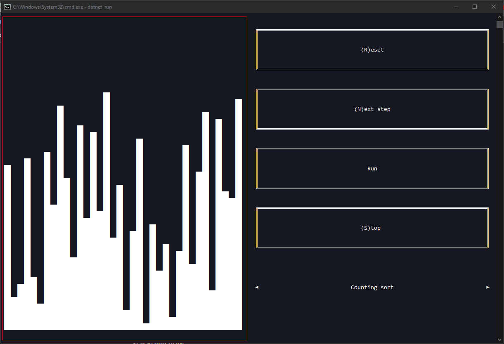

# Uživatelská dokumentace k Sorter

Sorter je terminálová aplikace na vizualizaci některých třídících algoritmů.

## Terminál

Pokud je terminál je menší než 150x75 znaků, tak můžete použít následující klásové zkraty na pohyb:

| Klávesová zkratka                 | Popis                           |
| --------------------------------- | ------------------------------- |
| <kbd>⇧ Shift</kbd> + <kbd>↓</kbd> | Posune viditelnou část dolů     |
| <kbd>⇧ Shift</kbd> + <kbd>↑</kbd> | Posune viditelnou část nahoru   |
| <kbd>⇧ Shift</kbd> + <kbd>←</kbd> | Posune viditelnou část do leva  |
| <kbd>⇧ Shift</kbd> + <kbd>→</kbd> | Posune viditelnou část do prava |

## Ovládání

| Klávesová zkratka                                   | Popis                                     |
| --------------------------------------------------- | ----------------------------------------- |
| <kbd>Enter</kbd>                                    | Výběr/Aktivace zvýrazněného prvku         |
| <kbd>Esc</kbd>, <kbd>Q</kbd>                        | Pro ukončení aplikace nebo opuštění prvku |
| <kbd>↑</kbd>,<kbd>→</kbd>,<kbd>↓</kbd>,<kbd>←</kbd> | Pohyb mezi prvky                          |

### Přepnutí algoritmu

Pro přepnuntí algoritmu slouží prvek `Switch`, který se ovládá pomocí <kbd>←</kbd>,<kbd>→</kbd> nebo <kbd>Enter</kbd>.

### Ovládání animace

Pro ovládání animace je zde několik tlačítek:

- Reset
  - Resetuje animaci
- Next step
  - Pokročí v animaci o jeden krok
- Run
  - Spustí animaci
- Stop
  - Zastaví animaci

Animaci můžeme ovládat také pomocí kláves, když aktivujete prvek s elementy na setřídění.

| Klávesová zkratka | Popis                          |
| ----------------- | ------------------------------ |
| <kbd>R</kbd>      | Resetuje animaci               |
| <kbd>N</kbd>      | Pokročí v animaci o jeden krok |
| <kbd>U</kbd>      | Spustí animaci                 |
| <kbd>S</kbd>      | Zastaví animaci                |

## Poznámky

- Pokud terminál zvětšíte nebo zmenšíte, tak stačí stisknou jakou koliv klávesu.
- Na některých terminálech nefunguje posun viditelné části.
